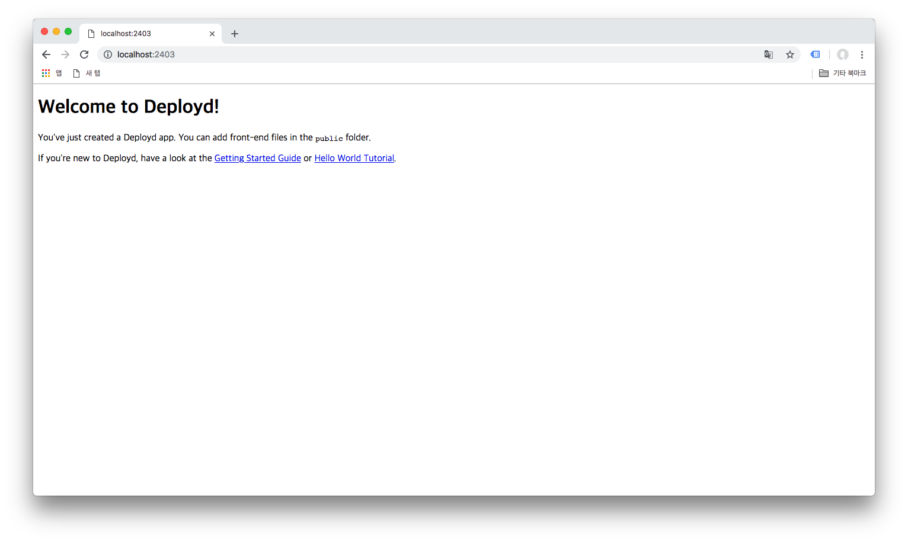
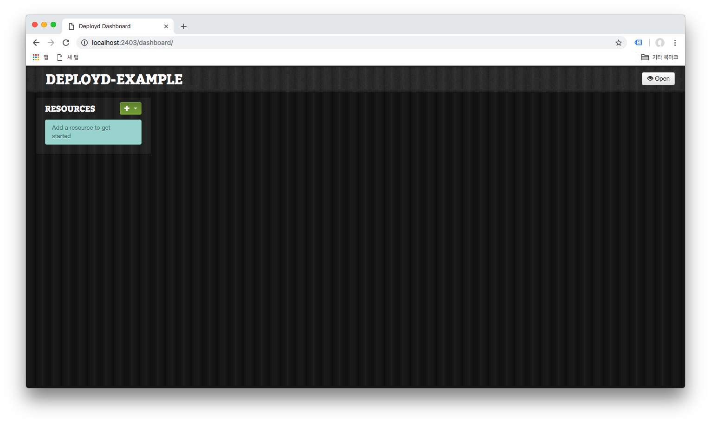

## Deployd 모듈 설정 예제

### 시작하기

1. Deployd 모듈 초기화 명령어

```bash
$ npm run create:db
```

2. Deployd 서버 띄우기

```bash
$ npm run start:server
```

3. Deployd 서버 대시보드와 함께 띄우기
```bash
$ npm run start:dashboard
```

서버가 띄워진 후에는 `localhost:2403` 에서 확인이 가능합니다.

 

대쉬보드에 접속하려면 `localhost:2403/dashboard` 에 접속하면 대시보드 역시 확인 가능합니다.

 

### RESTful API
Deployd 모듈은 아래와 같은 RESTful API 를 제공해주며, 각 메소드별 정보는 아래와 같다. 임의로 예제는 메모 어플리케이션을 기준으로 작성하였다.

#### GET Method

| Task | Route | Accepts | Returns |
| ---
| 메모 리스트 받아오기 | /memos | X | 데이터의 리스트 |

#### POST Method

| Task | Route | Accepts | Returns |
| ---
| 메모 생성하기 | /memos | 메모에 대한 정보 객체 | 생성된 데이터의 리스트 |

#### DELETE Method

| Task | Route | Accepts | Returns |
| ---
| 생성된 메모 삭제하기 | /memos/${id} | 메모에 대한 정보 객체 | X |

#### PUT Method

| Task | Route | Accepts | Returns |
| ---
| 생성된 메모 수정하기 | /memos/${id} | 메모에 대한 정보 객체 | 수정된 메모 객체 |

